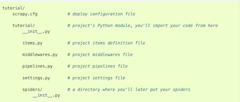

# Web Scraping For Better Datasets

To get the most out of this workshop, you’ll need to have [python](https://www.python.org/downloads/) and [scrapy](https://scrapy.org/) installed. If you haven’t used python before, we’re going to start with the simplest possible applications of it, so you should be able to follow along. If this ends up sparking your fancy, there are tons of resources available online, some of my favorites of which are linked on the workshop’s [are.na](https://www.are.na/brent-bailey/web-scraping-4-social-good).

Since there are likely a variety of skill levels in this group, fair warning: if you’re not familiar with the command line, some of the stuff in the practical portion of this workshop may be harder to follow, but you should be able to follow along by copying and pasting, and I’ll explain what’s happening at every step.

## What’s web scraping?

Simply put, it’s gathering and extracting data from a website or websites. If you’ve ever saved a meme from a website or copied and pasted text from an article, congrats! You’re a web scraper.

Generally, however, what people mean when they talk about web scraping is the automation of this process. Rather than manually searching flickr for pictures of trees and downloading them one by one, automated web scraping allows us to download every picture of a tree on flickr in a short amount of time by executing simple scripts or using software.

## What do people use it for?

## What tools can we use to scrape data?

### Basic

[wget] :

### High-Level

There are a whole lot of them, and you can also write your own! We’re going to focus primarily on scraping with Python, so here are a few of the most popular scraping tools.

[Scrapy](https://scrapy.org/): Python. High level, easy to use. Sometimes needs to be used with Selenium or Beautiful Soup for websites with a lot of dynamic content.
Good for crawling websites - visiting multiple pages in a single session. Extremely fast and extensible.

[Beautiful Soup](https://www.crummy.com/software/BeautifulSoup/): Python. The OG scraper, old, good for parsing HTML, lower level.

[Selenium](https://github.com/SeleniumHQ/selenium): APIs for a number of languages. Often used for web automation or testing. Works well with JavaScript and dynamic content - better at mimicking the way we actually interact with websites.

## Let’s write a scraper!

If you haven’t already, let’s install Scrapy. You can do this easily in the terminal with ```pip install scrapy```.

Once scrapy is installed, we can create an empty project folder for our scraper:
``` scrapy startproject babys-first-scraper```

This will create a folder called “babys-first-scraper”. if you enter the folder, it should contain a structure like this:


Now let’s start actually writing our scraper!

Go to the `spiders` directory within the `babys-first-scraper` folder:

```cd babys-first-scraper/spiders``` and create a spider file: ```touch text-spider.py```.

### Wait, what’s a spider?

A spider, also often called a web crawler, is a bot that automatically browses websites. This is how Google gets its search results, and also the primary method for most web scrapers of accessing the internet: rather than creating a spider for the entire world wide web, like google, we automate the process of visiting a single website or a few websites, then within the spider we can specify the data we want and download it.

### Back to making the spider

In your text editor of choice, open `text-spider.py`. We’ll start by telling it what website to visit: in this case, we’ll be using [books.toscrape.com](books.toscrape.com), a prebuilt website intended for people to test their scrapers on.

First, in the `text-spider.py` file, enter:

```
import scrapy

class TextSpider(scrapy.Spider):
  name=”text”
```

This tells the script to use Scrapy’s prebuilt Spider class, so we don’t have to deal with writing our own basic spider code. We then name the spider “text” since that’s what we’re focused on getting right now.

Now, below `name=”text”`, enter:

```
  def start_requests(self):
    #tell it which website(s) to visit
    urls=[
      ‘http://books.toscrape.com’]
    #visit each url
    for url in urls:
      #at each url, run the ‘parse’ function
      yield scrapy.Request(url=url, callback=self.parse)
    def parse(self, response):
      #set a filename to write the response to
      filename = ‘books.html’
      with open(filename, ‘wb’) as f:
        f.write(response.body)
      self.log(‘Saved file %s’ % filename)
```

We now have the simples possible spider, so let’s run it!


